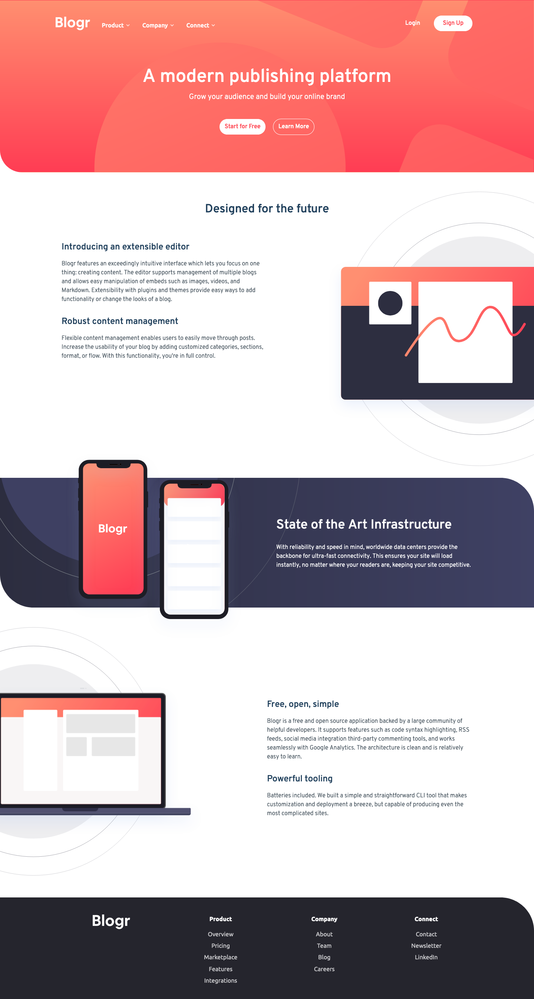

# Frontend Mentor - Blogr landing page solution

This is a solution to the [Blogr landing page challenge on Frontend Mentor](https://www.frontendmentor.io/challenges/blogr-landing-page-EX2RLAApP). Frontend Mentor challenges help you improve your coding skills by building realistic projects.

## Table of contents

- [Overview](#overview)
  - [The challenge](#the-challenge)
  - [Screenshot](#screenshot)
  - [Links](#links)
- [My process](#my-process)
  - [Built with](#built-with)
  - [What I learned](#what-i-learned)
  - [Continued development](#continued-development)
  - [Useful resources](#useful-resources)
- [Author](#author)

**Note: Delete this note and update the table of contents based on what sections you keep.**

## Overview

### The challenge

Users should be able to:

- View the optimal layout for the site depending on their device's screen size
- See hover states for all interactive elements on the page

### Screenshot

### Links

- Solution URL: [View Code](https://github.com/Rabin92/blogr-landing-page)
- Live Site URL: [Go Live](https://blogr.vercel.app)

## My process

### Built with

- Semantic HTML5 markup
- Sass
- CSS Flexbox
- CSS Grid
- Mobile-first Responsive Design
- [JavaScript](https://javascript.info) - Vanilla JS

### What I learned

I learned how to create a dropdown sub-menu using a vanilla CSS.

### Continued development

I will continue learning about positioning background image as I am still not fully comfortable with this concept.

### Useful resources

- [Bold on hover](https://css-tricks.com/bold-on-hover-without-the-layout-shift/) - This article helped me fix my anchor tag issue.
- [pseudo-element](https://developer.mozilla.org/en-US/docs/Web/CSS/Pseudo-elements) - I'd recommend it to anyone to learn and understand the pseudo-element concept as it's very beneficial.

## Author

- Website - [Rabin Gharti Magar](https://www.rabingm.dev/)
- Frontend Mentor - [@Rabin92](https://www.frontendmentor.io/profile/Rabin92)
